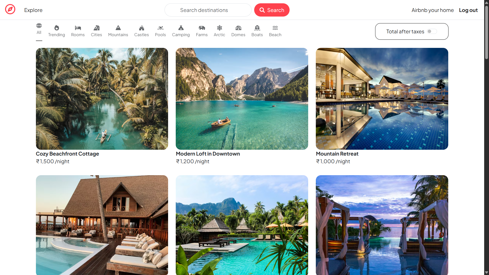
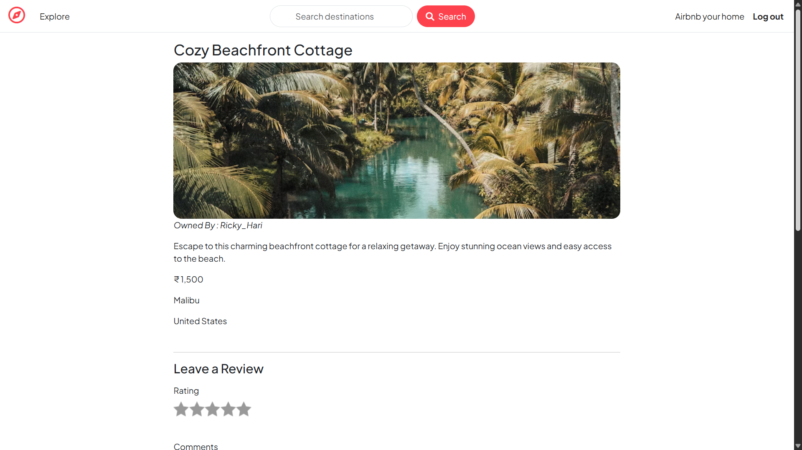
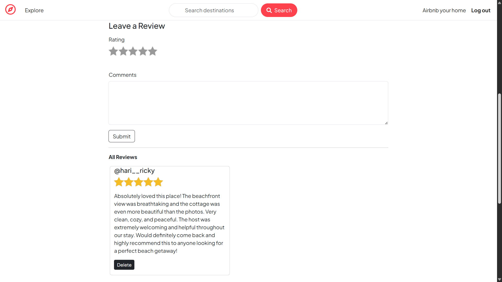
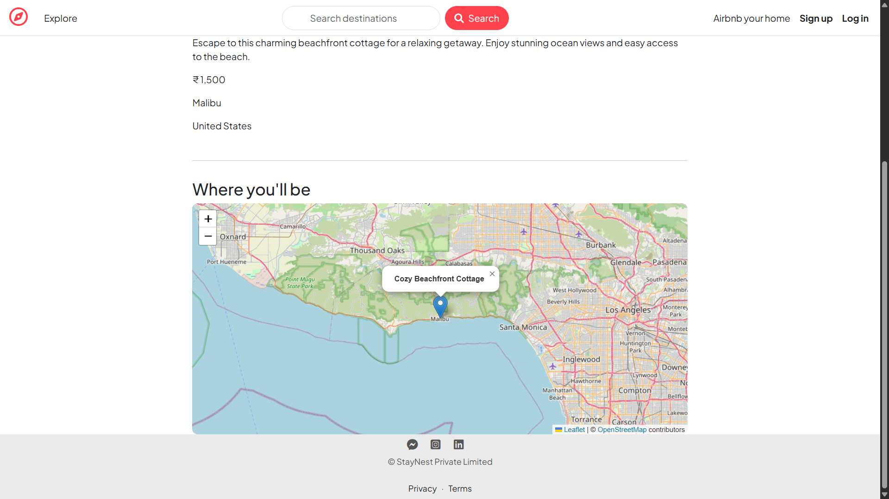
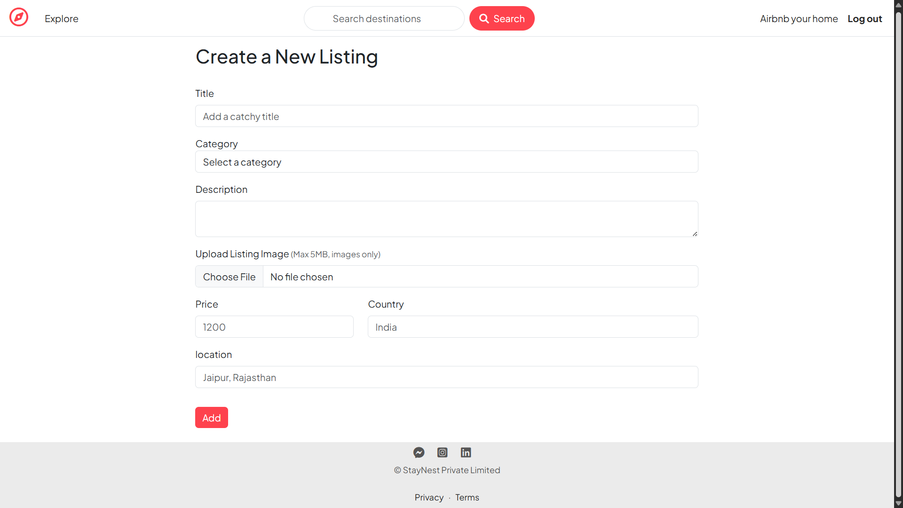

# 🏡 StayNest – A Full Stack Airbnb-Inspired Property Rental Platform

StayNest is a full-stack web application inspired by Airbnb where users can explore, create, and manage property listings with integrated location-based features, and secure authentication.

---

## 🚀 Live Demo

👉 https://staynest-m6ou.onrender.com

---

## 📌 Features

* 🔐 User Authentication (Signup/Login/Logout)
* 🏠 Create, Edit & Delete Listings
* 🖼️ Image Upload using Cloudinary
* 🔍 Search & Category-based Filtering
* 🌍 Location-based Listings (Geocoding + Maps)
* ⭐ Review & Rating System
* 💬 Flash Messages & Server-side Validation
* 📱 Fully Responsive UI (Mobile + Desktop)

---

## 🛠️ Tech Stack

### 🔹 Frontend

* HTML
* CSS (Bootstrap)
* EJS (Templating Engine)

### 🔹 Backend

* Node.js
* Express.js

### 🔹 Database

* MongoDB Atlas
* Mongoose

### 🔹 APIs & Tools

* Cloudinary (Image Hosting)
* OpenCage API (Geocoding)
* Leaflet.js (Maps)

---

## 📂 Project Structure

```
StayNest/
│
├── models/        # Mongoose schemas
├── routes/        # Express routes
├── views/         # EJS templates
├── public/        # Static files (CSS, JS)
├── init/          # Database seeding scripts
├── utils/         # Helper functions & middleware
├── app.js         # Main server entry point
└── package.json
```

---

## ⚙️ Installation & Setup

### 1. Clone the repository

```
git clone https://github.com/rickyhari/StayNest.git
cd StayNest
```

### 2. Install dependencies

```
npm install
```

### 3. Create a `.env` file

```
ATLASDB_URL=your_mongodb_connection_string
SECRET=your_session_secret
OPENCAGE_API_KEY=your_geocoding_api_key
CLOUDINARY_CLOUD_NAME=your_cloud_name
CLOUDINARY_KEY=your_key
CLOUDINARY_SECRET=your_secret
```

### 4. Run the application

```
node app.js
```

---

## 🌱 Seed Data (Optional)

To populate the database with sample listings:

```
node init/index.js
```

---

## 📸 Screenshots

### 🏠 Explore Listings


### 📄 View Listing Details


### ⭐ Reviews & Ratings


### 📍 Location on Map


### ➕ Create New Listing


---

## ⚡ Challenges Faced

* 🌍 **Geocoding Integration**

  * Handling API responses and converting them into GeoJSON format.
  * Managing cases where location data was missing or invalid.

* 🗺️ **Latitude–Longitude Mismatch**

  * Different services (GeoJSON vs Leaflet) use different coordinate formats.
  * Required careful conversion to display correct map locations.

* 📦 **Image Upload Handling**

  * Managing file uploads using Multer and storing them on Cloudinary.
  * Ensuring validation and fallback for missing images.

* 🔐 **Authentication & Session Handling**

  * Implementing Passport.js for login/signup.
  * Handling session persistence and secure cookies.

* 🚀 **Deployment Issues (Render + MongoDB Atlas)**

  * Fixing environment variables in production.
  * Handling dynamic port (`process.env.PORT`) instead of hardcoding.
  * Debugging database connection issues.

* 📱 **Responsive Design**

  * Fixing layout issues across mobile and large screens.
  * Managing flexbox + Bootstrap conflicts.

---

## 🧠 Key Learnings

* Building scalable backend with Express & MongoDB
* Implementing authentication using Passport.js
* Working with third-party APIs (Geocoding & Maps)
* Handling real-world deployment issues
* Writing cleaner and maintainable code structure

---

## 🔮 Future Improvements

* ❤️ Wishlist feature
* 💳 Payment integration
* 🧑‍💼 User profiles
* 📊 Admin dashboard

---

## 👨‍💻 Author

* GitHub: https://github.com/rickyhari
